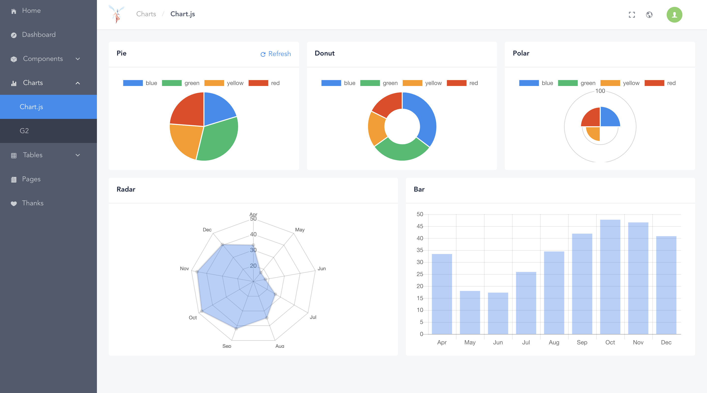
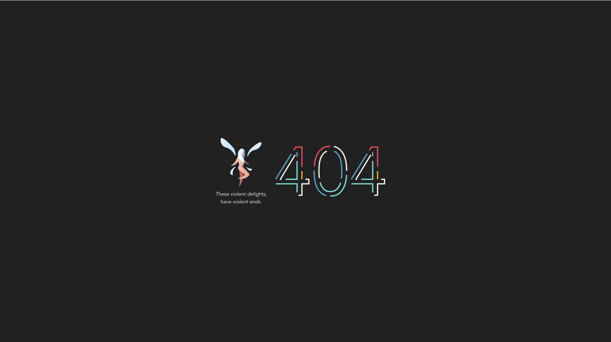
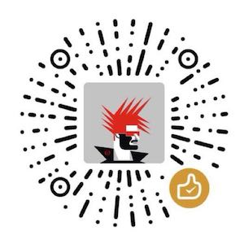

<div align="center">
  
</div>

# Prophet

Beautiful dashboard based on [Vue](https://vuejs.org/) and [iView](https://www.iviewui.com/). [Demo](https://syaning.github.io/prophet)

> Logo from https://www.iconfinder.com/icons/2913099/character_cute_elf_fairy_fantasy_magic_rpg_icon

## Build Setup

``` bash
# install dependencies
npm install

# serve with hot reload at localhost:8080
npm run dev

# build for production with minification
npm run build

# build for production and view the bundle analyzer report
npm run build --report
```

## Screenshot





## Sponsor



## License

[MIT](./LICENSE)
